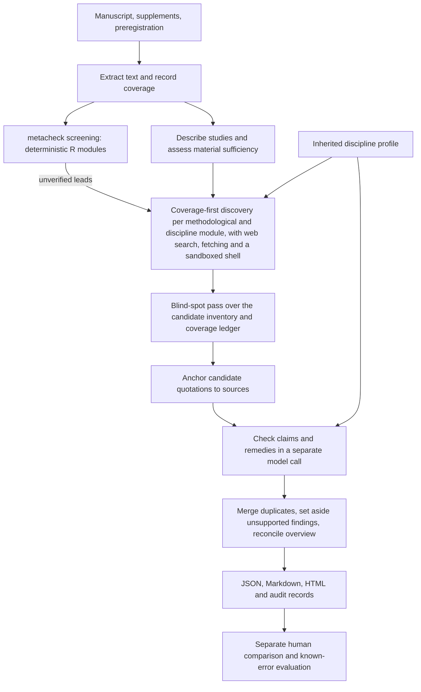

# Architecture

ReviScope is an independent, coarse-inspired manuscript review engine. It does not import or monkey-patch the coarse pipeline. David Van Dijcke's coarse project provided the architectural starting point: staged review, source quotations, verification, and editorial synthesis. See THIRD_PARTY_NOTICES.md for precise component provenance.

## Boundaries

The engine handles source loading, typed stage outputs, backend calls, cache identity, and report rendering. Discipline profiles supply authored review and verification criteria. Methodological modules (such as measurement or statistical inference) are reusable between disciplines. Every stage receives sources as evidence, never as instructions. Review stages run with web search, web fetching and a sandboxed shell, and record every tool call as stage provenance. Findings may cite external evidence, and each also anchors in an exact manuscript quotation. Models generate candidate findings; verification and editorial disposition remain separately inspectable.

A complete pipeline run is not a validated scientific verdict. A source quote establishes provenance, not whether the criticism follows. Recomputation with code is limited by what the manuscript reports and by the assumptions the model states. The report must distinguish supported criticisms, contradicted candidates, unresolved issues, and assessment limitations.

## Extension contract

A new discipline should normally require a profile and rubric text, not a new engine. The profile includes generation criteria, verification criteria, applicability guidance, and examples of defensible practices that must not attract rote criticism. An additional methodological capability may require a module implementation with the same input/output contract as existing modules. The education profile demonstrates inheritance; it does not claim validated education-review quality.

Profile inheritance must be deterministic, reject cycles and unknown module identifiers, and contribute all effective rubric content to the cache key. Scientific evidence requirements cannot be weakened by author steering.

## Run integrity

All finding identifiers are stable within a run. Candidate records survive editorial rejection and deduplication. Failures in optional or review stages are reported as incomplete coverage; a cache never converts a failed stage into a successful one. Source content hashes, extraction configuration, profile/rubric content, model/backend settings, and stage/schema versions identify cached results.

## Evaluation separation

The generation pipeline never sees benchmark labels or historical reviews. The evaluation harness receives those artifacts separately. Historical reviews only compare fairly against the manuscript version originally reviewed; the final revised publication can have already addressed the objections. Pairwise presentation is blinded and order-swapped. An independent model can help audit findings, but its assent is not a ground-truth label. Random human-audit sampling and targeted diagnostic inspection remain distinct.

## Review flow

The default profile is `social_psychology`, which extends `quantitative_social_science`. No stage limits the number of findings; published findings are ordered by severity. A finding is published when the verifier supports it and at least one quotation from the manuscript anchors, from either the generating model or the verifier; quotations that do not anchor are dropped and recorded. Concerns the verifier judges unresolved on the evidence appear in a separate report section with its reason. See [discovery and verification](DISCOVERY.md). A different model family can perform verification; the report records whether this is a same-model call, a different model in the same family, or a different model family. Quote anchoring does not establish the criticism's truth. Unsupported advice is withheld independently of the factual criticism. Failed verification cannot be overridden by editorial selection.

Generation and evaluation are separate processes. The reviewer receives the supplied manuscript sources and profile, never historical reviews or benchmark error annotations. The evaluator receives final published substantive content with pipeline provenance removed for blinding; it retains the manuscript and comparator provenance in separate audit artifacts.

Editorial synthesis reconciles the displayed overview, contribution summary, and strengths with supported findings. The original study map remains in `preliminary_study_map` for audit. A model-backed editorial response that omits this reconciliation fails explicitly; the report labels the unreconciled account as preliminary. This prevents an early summary from silently praising a feature challenged by the final review.
