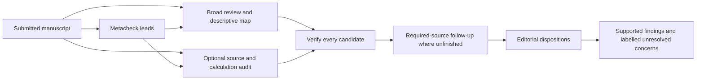

# Pipeline development and validation

## What the pipeline must earn

The reference is a fresh single tool-enabled review using the same model, reasoning
effort, manuscript extraction and backend version. Added stages must deliver correct,
material, usable criticism or remove incorrect advice at a defensible cost. Tool logs,
quote anchors and a high verifier support rate are not substitutes for that assessment.
Finding count is not a success criterion, and no production stage caps findings.

Review quality covers errors and inconsistencies, citation-claim agreement,
interpretation and overclaims, methodological and conceptual reasoning, and reporting
or presentation changes with a concrete benefit to the reader. Error retrieval measures
one part of that quality. Comparisons assess useful contributions across this full
scope, alongside incorrect criticism, unnecessary requests and the cost to authors.
These are evaluation dimensions, not discovery quotas or a requirement to find an
issue of each type. A justified suggestion can improve a paper without alleging an
error; its premises, purpose and proportionality still require assessment.

The opt-in candidate combines a broad read, full-criticism verification, recorded
source tasks and editorial reconciliation. A separate operational audit is an optional
arm. These are development hypotheses; the specialist strategy remains available and
no configuration has established scientific validity.

The audit receives neither broad findings nor the overview. Verification and editorial
use tools; preference judges and normalization use no tools. The factual gates,
external-source policy, contamination audit and editorial publication rules are shared
across discovery strategies. Editorial cannot rewrite a finding or its severity.

## Training corpus and development pilot

The entire Meta-Psychology corpus, including the four submissions not yet used in the
initial pilot, is designated training/development data by the owner on 5 October 2026.
Here training means pipeline and prompt development, not model weight training.
Use all six cases to diagnose and repair review-quality failures; any performance
reported on them is development evidence. Human reports remain excluded from review
generation and are comparators, not correctness labels. An independent validation
set will be selected later; none of these cases can establish independent validation.

The two first cases are a six-experiment group-membership/deviance-punishment submission
and a two-experiment direct/indirect-harm replication submission. Their author labels
in the cache are `bonetto` and `ziano`; they are papers, not configurations. The
[comparison corpus](OPEN_REVIEW_COMPARISONS.md) verifies submitted versions and supplies
two first-round human reports per case. These cases support development, not a claim
of validation.

Compare three arms with Sol/high discovery:

* plain one-call review without the category checklist;
* holistic discovery with full finalization and an Opus/high tool-enabled verifier;
* the same broad discovery and verifier plus the optional evidence audit.

Share the broad read and its verification artifacts between the latter arms. Cache
reuse keeps the optional audit's marginal work visible. Record model identities,
backend versions, source and code hashes, tool traces, stage durations, screening time,
candidate/publication counts, claim types and required-source completion. Freeze code
before generation, with all human reports, editor letters, revisions and annotations
excluded from reviewer inputs. Keep flagged and partial outputs separate. A reviewer
can have encountered a public paper in training; tool isolation cannot exclude that.

Opus supplies architectural and implementation feedback. Using it for verification
and preference judging creates a related-output bias risk; Sol sensitivity judgments
are also required. Both judges receive metadata-stripped reviews and the submitted
manuscript. Review-generation sessions receive no human report or judge feedback.

## LLM-as-judge assessment

Compare each arm against each selected human report and compare AI arms directly.
Run both presentation orders, permit ties, and retain each judge's answers separately.
Rate correctness, importance, specificity, source grounding and actionability. Praise
and theoretical feedback count as review content; matching a human criticism does not
establish correctness. Disagreement between the two orders is a diagnostic, not two
independent votes. Human reviewers and multiple runs of one paper are also not
independent papers.

Use the existing published-findings condition as the primary comparison. Assess
author-visible unresolved concerns separately. A complete-report condition can test
whether those concerns help an author without crediting them as established errors.
Keep representation fixed within each condition. A tool-free, audited normalization
condition removes style and severity labels while preserving every substantive point;
compare it with native prose to expose representation sensitivity. Never truncate a
review to equalize lengths.

Whole-review preference needs a criticism-level correctness check. Pool atomic
criticisms from all systems and human reports, cluster by underlying defect and
consequence with origin hidden, and check cluster boundaries on a human-reviewed
sample. Judges should assess the claim against the manuscript without the generator's
persuasive rationale or verification badge. Mark claims requiring unavailable external
evidence uncertain; separately investigate disputed claims with tools and code.

Check explanatory rationales as well as headline claims. The pipeline verifier receives
the complete claim and rationale, proposed remedy, quotations and external items. It
treats the generating rationale as untrusted assertions requiring independent checks.
Support requires justified factual premises, calculations, citation use and reasoning
throughout the criticism. An inaccessible source needed by the rationale leaves the
criticism unresolved even when its headline is plausible. The proposed remedy is
assessed separately for necessity and proportionality. Calibration includes a true
headline with an incorrect supporting calculation or an unavailable source-specific
assertion. Operation code/output matching establishes a recorded execution, rather
than an independent check of the calculation or its assumptions.

Position, verbosity and self-preference biases are documented in
[Zheng et al.'s judge study](https://arxiv.org/abs/2306.05685). Order swaps, two judge
families, representation checks and human calibration are controls for this task;
they do not establish the judges' accuracy on manuscript criticism.

Report outcomes by paper, including ties and uncertainty, and bootstrap at the paper
level if sample size supports an interval. Two development papers cannot establish a
reliable preference advantage. Do not interpret a small score difference as success.

## Error retrieval and precision

Papers 5 and 9 are regression cases shaped by development feedback. Use them to locate
losses in discovery, verification, source tasks and editorial; do not present gains
there as held-out validation. Keep the established annotation scoring and contamination
rules unchanged. Report strict recall over all annotations, the independently audited
demonstrable subset, and reporting-gap/weak-annotation strata separately.

The next retrieval check uses two to four untested papers before a replicated full
series. Inspect candidate and published recall alongside author-visible uncertainty.
Review every unmatched published criticism for factual support: an unmatched finding
can be useful, incorrect or outside the planted target's scope. Do not count every
unmatched finding as a false positive. Clean original versions provide negative
controls for the planted claim, while still allowing unrelated valid criticisms.

Create an eval-only verifier calibration set with expert-checked true and false
criticisms: a misquoted number, a purported conflict between compatible passages, an
absence claim defeated elsewhere, a source-specific assertion requiring a lookup,
and a true error with defeating context that does not resolve it. Keep these probes
out of review reports and reviewer discovery inputs. Assess both verifier families
for supported false claims, held true claims, and source coverage.

A confirmatory retrieval series freezes the candidate and baseline before running
all ten papers, with at least two independent runs per configuration. This is forty
reviews, plus judges and criticism audits. Treat the paper as the sampling unit and
runs as repeated measures. Ten papers give limited precision; expand manuscripts
rather than judging one output repeatedly when the uncertainty concerns generalization.

## Limited human assessment

Start with two methods-qualified assessors per development paper. Give them blinded
criticism clusters, the submitted manuscript and relevant passages. Include all
claims unique to an added stage, all judge-disagreement cases, all major/critical
claims suspected of being incorrect, and a reproducibly sampled 20% of remaining
clusters. This sampling controls evaluation work, not review output. Record inclusion
probabilities and keep stratum estimates separate; do not treat this selected sample
as an unweighted estimate of overall precision.

For each cluster ask: supported, contradicted or unresolved; consequence for a central
claim; whether the proposed action is necessary and feasible; and whether an author
would benefit from acting on it. Provide an abstention/insufficient-expertise option.
Two independent ratings precede discussion; a methods expert resolves consequential
disagreements, with the original ratings retained.

A small crowd exercise can use 8–12 methods-trained researchers, each assessing a few
short packets for clarity, specificity and actionability. Technical correctness needs
qualified assessors, rather than unrestricted public voting. Include known calibration
items, balance system/order assignment, measure time and collect uncertainty. A paid
study budgets compensation from pilot task times at an agreed hourly rate; volunteer
participation is explicitly described as such. Recruitment, consent and any relevant
ethics review are prepared before contacting people. This document authorizes no
recruitment, messaging, public upload of manuscripts or spending.

## Advancement decisions

Write the decision criteria before inspecting holdout results:

* The candidate must preserve baseline retrieval of demonstrable errors and correct,
  material review clusters, within a prespecified uncertainty margin. A severity hold
  is a recorded loss even if the underlying supported finding remains in JSON.
* Added stages must contribute expert-supported, non-redundant material criticism or
  prevent harmful advice. Report contribution and added calls/stage time per paper;
  a positive example on one paper is insufficient for retaining a stage by default.
* Report unsupported published advice, particularly major/critical advice, alongside
  recall and preference. A preference win cannot compensate for harmful incorrectness.
* Authors or qualified assessors must find the report usable, including proportional
  remedies and clear separation of supported findings from uncertainty.

The four remaining curated submissions extend the training/development comparison,
with at least two runs per AI configuration when separately budgeted. Freeze and retain
each diagnostic condition before tuning, but do not describe these submissions as an
independent validation set. Confirm any promising result on a separately selected,
unseen corpus across the intended profile family. Choose the acceptable quality
margin and cost premium from pilot human ratings and task times before confirmatory
testing; the development pilot does not supply defensible numerical thresholds.

Severity revision during editorial, an expanded author-visible section for supported
severity-held claims, pipeline-executed recomputation as a new publication route, and
changes to external-source/audit gates are separate owner decisions. The candidate
keeps those contracts intact.

## Reasoning-assessment development probes

The shared reasoning guidance and optional audit records are described in
[the implementation record](REASONING_ASSESSMENT_IMPLEMENTATION.md). The offline
`tests/fixtures/reasoning_probes.json` packets cover support following a claim, related
prose preceding a false claim, distributed support, accurate single-citation and
inaccurate multiple-citation relations, sufficient aggregate evidence, unavailable
coding material, a supplement resolving that gap, competing mechanisms, missing
premises, circular support, privacy withholding and captions without image pixels.
They are handcrafted development probes with scripted backend responses, not expert
adjudications or measurements of model accuracy. Regression tests establish artifact
preservation, quotation anchoring, unchanged publication/source gates, guidance routing
and cache behavior.

For scientific assessment, have qualified assessors adjudicate these packets and add
unseen positive and negative variants. Compare the frozen baseline and prompt change
with the same model, extraction, tool access and publication gates. Assess added correct,
material, non-redundant criticism, false absence claims, missed defeating context,
unsupported advice, remedy burden and marginal cost by paper. A larger operation ledger
or higher model support rate is not an improvement criterion. The optional audit stays
optional pending those comparisons. No bulk model run, recruitment or expenditure is
authorized by this plan itself.
